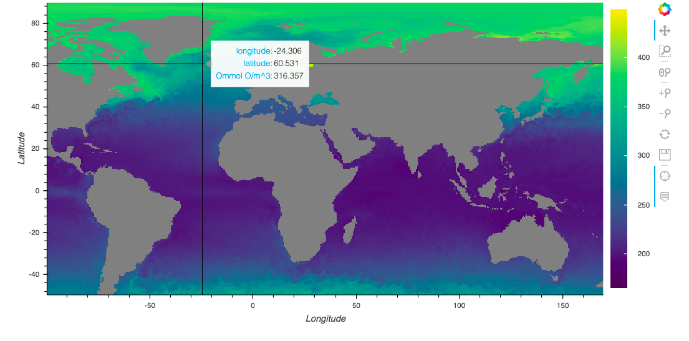

# Regional Map Method





<div markdown="1" class="cell code_cell">
<div class="input_area hidecode" markdown="1">
```python
import sys
!{sys.executable} -m pip install netCDF4
!{sys.executable} -m pip install xarray
import opedia
import math
import common as com
from opedia import plotRegional as REG
import netCDF4
import xarray as xr
import numpy as np
from datetime import datetime
from dateutil.parser import parse
from bokeh.plotting import figure, show, output_file
from bokeh.layouts import column
from bokeh.palettes import all_palettes
from bokeh.models import HoverTool, LinearColorMapper, BasicTicker, ColorBar, DatetimeTickFormatter
from bokeh.models.annotations import Title
from bokeh.embed import components
from tqdm import tqdm_notebook as tqdm
from netCDF4 import num2date, date2num
%run -i 'a.py'

```
</div>

<div class="output_wrapper" markdown="1">
<div class="output_subarea" markdown="1">
{:.output_stream}
```
Requirement already satisfied: netCDF4 in /Users/VeerGadodia/.local/lib/python3.7/site-packages (1.5.1.2)
Requirement already satisfied: cftime in /Applications/anaconda3/lib/python3.7/site-packages (from netCDF4) (1.0.3.4)
Requirement already satisfied: numpy>=1.7 in /Applications/anaconda3/lib/python3.7/site-packages (from netCDF4) (1.16.2)
WARNING: You are using pip version 19.1.1, however version 19.2.1 is available.
You should consider upgrading via the 'pip install --upgrade pip' command.
Requirement already satisfied: xarray in /Applications/anaconda3/lib/python3.7/site-packages (0.12.1)
Requirement already satisfied: numpy>=1.12 in /Applications/anaconda3/lib/python3.7/site-packages (from xarray) (1.16.2)
Requirement already satisfied: pandas>=0.19.2 in /Applications/anaconda3/lib/python3.7/site-packages (from xarray) (0.24.2)
Requirement already satisfied: pytz>=2011k in /Applications/anaconda3/lib/python3.7/site-packages (from pandas>=0.19.2->xarray) (2018.9)
Requirement already satisfied: python-dateutil>=2.5.0 in /Applications/anaconda3/lib/python3.7/site-packages (from pandas>=0.19.2->xarray) (2.8.0)
Requirement already satisfied: six>=1.5 in /Applications/anaconda3/lib/python3.7/site-packages (from python-dateutil>=2.5.0->pandas>=0.19.2->xarray) (1.12.0)
WARNING: You are using pip version 19.1.1, however version 19.2.1 is available.
You should consider upgrading via the 'pip install --upgrade pip' command.
```
</div>
</div>
</div>


#### NetCDF4 file(s) to read from:


<div markdown="1" class="cell code_cell">
<div class="input_area" markdown="1">
```python
xFile = xr.open_dataset('http://3.88.71.225:80/thredds/dodsC/las/id-a1d60eba44/data_usr_local_tomcat_content_cbiomes_20190510_20_darwin_v0.2_cs510_darwin_v0.2_cs510_nutrients.nc.jnl')


```
</div>

</div>


#### Parameters (CDF4 tables, variables (with respect to table), time/longitude/latitude/depth constraints):


<div markdown="1" class="cell code_cell">
<div class="input_area" markdown="1">
```python

tables = [xFile]
variables = ['O2']
startDate = '2016-04-30'
endDate = '2017-04-30'
lat1, lat2 = -50, 90
lon1, lon2 = -100, 170
depth1, depth2 = 0, 50
fname = 'regional'
exportDataFlag = False

```
</div>

</div>


### Testing Space


<div markdown="1" class="cell code_cell">
<div class="input_area" markdown="1">
```python
regionalMap(tables, variables, startDate, endDate, lat1, lat2, lon1, lon2, depth1, depth2, fname, exportDataFlag)


```
</div>

<div class="output_wrapper" markdown="1">
<div class="output_subarea" markdown="1">
{:.output_data_text}
```
HBox(children=(IntProgress(value=0, description='overall', max=1, style=ProgressStyle(description_width='initi…
```

</div>
</div>
<div class="output_wrapper" markdown="1">
<div class="output_subarea" markdown="1">
{:.output_stream}
```

```
</div>
</div>
<div class="output_wrapper" markdown="1">
<div class="output_subarea" markdown="1">
{:.output_traceback_line}
```

    ---------------------------------------------------------------------------

    AttributeError                            Traceback (most recent call last)

    ~/Documents/SummerInternship2019/myonlinebook/content/02/a.py in <module>()
    ----> 1 regionalMap(tables, variables, startDate, endDate, lat1, lat2, lon1, lon2, depth1, depth2, fname, exportDataFlag)
          2 


    ~/Documents/SummerInternship2019/myonlinebook/content/02/a.py in regionalMap(tables, variabels, dt1, dt2, lat1, lat2, lon1, lon2, depth1, depth2, fname, exportDataFlag)
          4         unit = tables[i].variables[variables[i]].attrs['units']
          5 
    ----> 6         toDateTime = tables[i].indexes['TIME'].to_datetimeindex()
          7         tables[i]['TIME'] = toDateTime
          8         table = tables[i].sel(TIME = slice(startDate, endDate), LAT_C = slice(lat1, lat2), LON_C = slice(lon1, lon2), DEP_C = slice(depth1, depth2))


    AttributeError: 'DatetimeIndex' object has no attribute 'to_datetimeindex'


```
</div>
</div>
</div>

