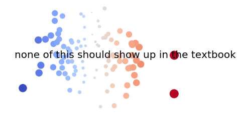

# Content with notebooks

You can also create content with Jupyter Notebooks. The content for the current page is contained
in a Jupyter Notebook in the `notebooks/` folder of the repository. This means that we can include
code blocks and their outputs, and export them to Jekyll markdown.

**You can find the original notebook for this page [at this address](https://github.com/jupyter/jupyter-book/blob/master/jupyter_book/minimal/content/features/notebooks.ipynb)**

## Markdown + notebooks

As it is markdown, you can embed images, HTML, etc into your posts!


You an also $add_{math}$ and

$$
math^{blocks}
$$

or

$$
\begin{align*}
\mbox{mean} la_{tex} \\ \\
math blocks
\end{align*}
$$

But make sure you \\$Escape \\$your \\$dollar signs \\$you want to keep!

## Code blocks and image outputs

Textbooks with Jupyter will also embed your code blocks and output in your site.
For example, here's some sample Matplotlib code:


<div markdown="1" class="cell code_cell">
<div class="input_area" markdown="1">
```python
from matplotlib import rcParams, cycler
import matplotlib.pyplot as plt
import numpy as np
plt.ion()

```
</div>

</div>


<div markdown="1" class="cell code_cell">
<div class="input_area" markdown="1">
```python
# Fixing random state for reproducibility
np.random.seed(19680801)

N = 10
data = [np.logspace(0, 1, 100) + np.random.randn(100) + ii for ii in range(N)]
data = np.array(data).T
cmap = plt.cm.coolwarm
rcParams['axes.prop_cycle'] = cycler(color=cmap(np.linspace(0, 1, N)))


from matplotlib.lines import Line2D
custom_lines = [Line2D([0], [0], color=cmap(0.), lw=4),
                Line2D([0], [0], color=cmap(.5), lw=4),
                Line2D([0], [0], color=cmap(1.), lw=4)]

fig, ax = plt.subplots(figsize=(10, 5))
lines = ax.plot(data)
ax.legend(custom_lines, ['Cold', 'Medium', 'Hot']);

```
</div>

<div class="output_wrapper" markdown="1">
<div class="output_subarea" markdown="1">

{:.output_png}


</div>
</div>
</div>


Note that the image above is captured and displayed by Jekyll.


## Removing content before publishing

You can also remove some content before publishing your book to the web. For example,
in [the original notebook](https://github.com/jupyter/jupyter-book/blob/master/jupyter_book/minimal/content/features/notebooks.ipynb) there
used to be a cell below...


<div markdown="1" class="cell code_cell">
<div class="input_area" markdown="1">
```python
thisvariable = "none of this should show up in the textbook"

fig, ax = plt.subplots()
x = np.random.randn(100)
y = np.random.randn(100)
ax.scatter(x, y, s=np.abs(x*100), c=x, cmap=plt.cm.coolwarm)
ax.text(0, .5, thisvariable, fontsize=20, transform=ax.transAxes)
ax.set_axis_off()

```
</div>

<div class="output_wrapper" markdown="1">
<div class="output_subarea" markdown="1">

{:.output_png}


</div>
</div>
</div>


You can also **remove only the code** so that images and other output still show up.

Below we'll *only* display an image. It was generated with Python code in a cell,
which you can [see in the original notebook](https://github.com/jupyter/jupyter-book/blob/master/jupyter_book/minimal/content/features/notebooks.ipynb)


<div markdown="1" class="cell code_cell">
<div class="input_area" markdown="1">
```python
# NO CODE
thisvariable = "this plot *will* show up in the textbook."

fig, ax = plt.subplots()
x = np.random.randn(100)
y = np.random.randn(100)
ax.scatter(x, y, s=np.abs(x*100), c=x, cmap=plt.cm.coolwarm)
ax.text(0, .5, thisvariable, fontsize=20, transform=ax.transAxes)
ax.set_axis_off()

```
</div>

<div class="output_wrapper" markdown="1">
<div class="output_subarea" markdown="1">

{:.output_png}


</div>
</div>
</div>


And here we'll *only* display a Pandas DataFrame. Again, this was generated with Python code
from [this original notebook](https://github.com/jupyter/jupyter-book/blob/master/jupyter_book/minimal/content/features/notebooks.ipynb).


<div markdown="1" class="cell code_cell">
<div class="input_area" markdown="1">
```python
# NO CODE
import pandas as pd
pd.DataFrame([['hi', 'there'], ['this', 'is'], ['a', 'DataFrame']], columns=['Word A', 'Word B'])

```
</div>

<div class="output_wrapper" markdown="1">
<div class="output_subarea" markdown="1">


<div markdown="0" class="output output_html">
<div>
<style scoped>
    .dataframe tbody tr th:only-of-type {
        vertical-align: middle;
    }

    .dataframe tbody tr th {
        vertical-align: top;
    }

    .dataframe thead th {
        text-align: right;
    }
</style>
<table border="1" class="dataframe">
  <thead>
    <tr style="text-align: right;">
      <th></th>
      <th>Word A</th>
      <th>Word B</th>
    </tr>
  </thead>
  <tbody>
    <tr>
      <th>0</th>
      <td>hi</td>
      <td>there</td>
    </tr>
    <tr>
      <th>1</th>
      <td>this</td>
      <td>is</td>
    </tr>
    <tr>
      <th>2</th>
      <td>a</td>
      <td>DataFrame</td>
    </tr>
  </tbody>
</table>
</div>
</div>


</div>
</div>
</div>


You can configure the text that *Textbooks with Jupyter* uses for this by modifying your site's `_config.yml` file.


## Interactive outputs

We can even do the same for *interactive* material. Below we'll display a map using `ipyleaflet`. When the notebook
is converted to Markdown, the code for creating the interactive map is retained.

**Note that this will only work for some packages.** They need to be able to output standalone HTML/Javascript, and not
depend on an underlying Python kernel to work.


<div markdown="1" class="cell code_cell">
<div class="input_area" markdown="1">
```python
import folium

```
</div>

</div>

